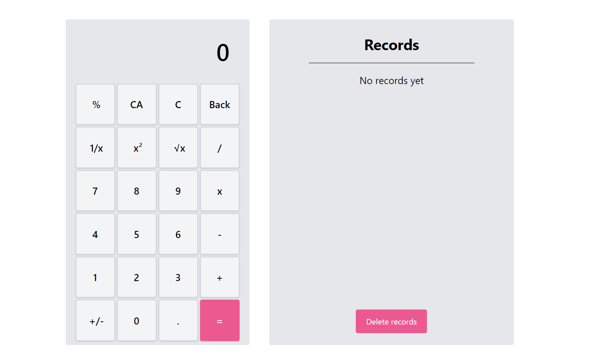
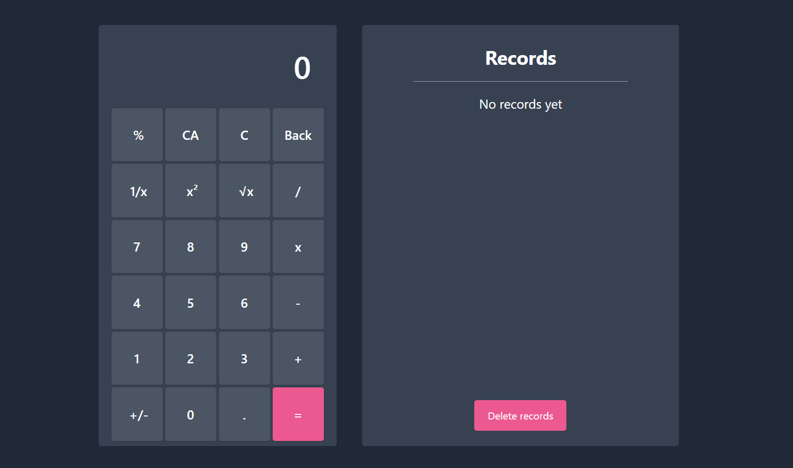

# React-Typescript Calculator  #

## Presentación 👋

Hola :) me alegra que vengas a este repositorio, este contenido ha sido realizado como práctica personal para estas tecnologías

Mi práctica consistió en construir una calculadora practicando el uso de Redux para manejo de estado global

## Muestra 👀

La calculadora tiene las funciones básicas de una calculadora y las operaciones se guardan en un historial.

Tiene tema claro y oscuro, cambiable con las configuraciones del sistema.

Acá pueden ver cómo funciona la aplciación en web: 

[Enlace a la aplicación](https://rt-calculator.netlify.app/)

- Tema claro: 

- Tema oscuro: 
  

## Comencemos 🚀

Para empezar ejecutemos los siguientes comandos en ese orden:
~~~
git clone https://github.com/JorgeRojas827/rt-calculator.git

cd rt-calculator

npm i
~~~

Y listo, puedes probar y jugar con el código :)

## Construido con 🛠️

- ### React JS
- ### Typescript
- ### Tailwind CSS
- ### Redux
- ### Axios

## Licencia 📄

Este proyecto está bajo la Licencia (MIT).

## ⌨️ con ❤️ por Jorge Rojas 🙌
